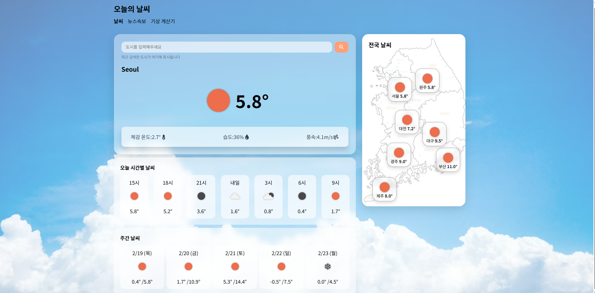
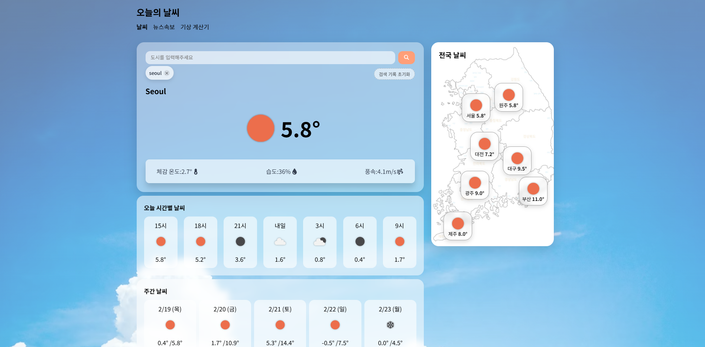
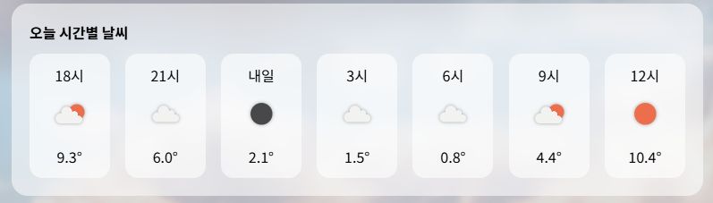
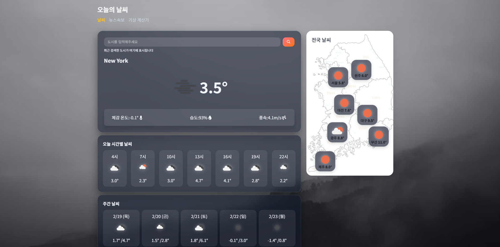
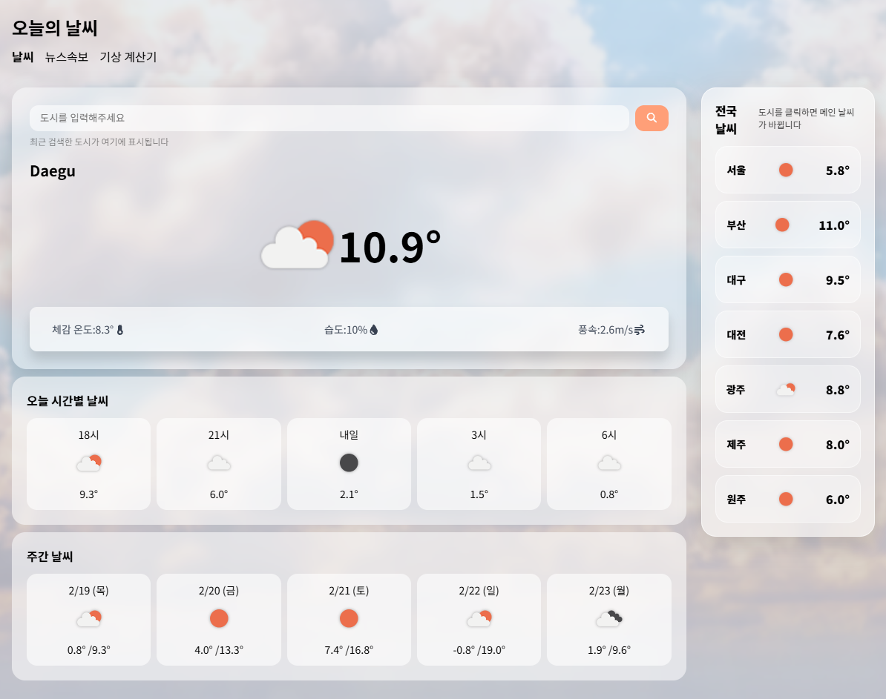
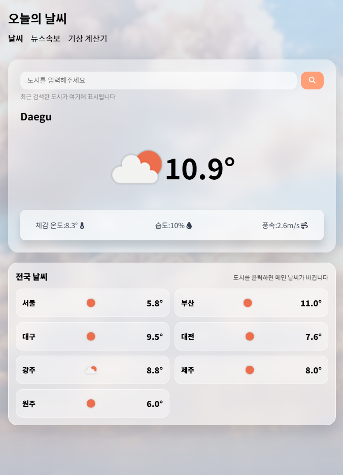

# 🌤️날씨 앱 제작
OpenWeather API를 활용하여
현재 날씨, 시간별 예보, 주간 예보, 전국 주요 도시 날씨 정보를 제공하는
React 기반 웹 애플리케이션입니다.

사용자의 위치 기반 날씨 조회와 도시 검색 기능을 제공하며
UI/UX 개선을 위해 다크모드, 스켈레톤 로딩, 배경 이미지 변경 기능을 구현했습니다.

## 📸 Preview

| 화면 | 설명 |
|------|------|
|  | 현재 위치 기반 날씨 |
|  | 도시 검색 |
|  | 시간별 예보 |
|  | 주간 예보 |
|  | 다크모드 |
|  | 태블릿 반응형 |
|  | 모바일 반응형 |

## ⚙️실행방법

- 레포지토리 클론
git clone https://github.com/ljj5928/WeatherApp.git

- 프론트 실행 (새 터미널)
cd weather
npm install
npm run dev

※ 본 프로젝트는 과제 제출용으로, API Key는 학습 목적상 프론트엔드에 포함되어 있습니다.
실서비스에서는 서버 환경 변수로 관리해야 합니다.

🔗 Live Demo
👉 https://ljj5928.github.io/WeatherApp/#/

## ✨핵심기능

- 현재 위치 기반 날씨정보
- 도시 검색 기능
- 시간별/주간 예보
- 날씨아이콘 시각화
- 온도 단위 변화

## 🔥차별화

- 스켈레톤 로딩
- 도시 시간에 따른 자동 다크 모드 전환
- 뉴스 api 연동
- 날씨 상태별 배경 변경

## 🛠 사용기술

### Frontend

- React
- Redux Toolkit
- React Router
- Axios

### UI / UX

- CSS
- 반응형 디자인
- 다크모드
- Skeleton Loading
- 날씨 상태별 배경 변경

### API

- OpenWeather API
- newsdata.io API

## 📁 프로젝트 구조

```bash
src/
├─ components/        # 공통 UI 컴포넌트
│  ├─ Header/         # 헤더 및 네비게이션
│  ├─ Nation/         # 전국 날씨 컴포넌트
│  └─ Pages/          # 페이지 단위 컴포넌트
│     ├─ Weather/     # 메인 날씨 페이지
│     ├─ News/        # 날씨 뉴스 페이지
│     └─ Calc/        # 온도 계산기
├─ redux/             # Redux Toolkit 상태 관리
├─ assets/            # 이미지 및 아이콘
├─ App.jsx
└─ main.jsx
```

## 주요 기능

### 현재 위치 기반 날씨 조회

- 브라우저 Geolocation API 사용
- 사용자 위치 자동 감지 후 날씨 정보 출력

### 도시 검색 기능

- 도시명 입력 시 해당 지역 날씨 조회
- Enter 입력 및 검색 버튼 지원
- 최근 검색 저장 기능 지원

### 시간별 날씨 제공

- 3시간 단위 예보 표시
- 아이콘 및 온도 정보 제공

### 주간 날씨 제공

- 날짜별 최고/최저 온도 표시

### 전국 주요 도시 날씨

- 여러 도시 날씨 비교 가능
- 클릭 시 해당 도시 날씨 조회

### 뉴스 제공

- 뉴스 API 연동
- 뉴스 목록 출력

### 다크모드

- 도시 날씨를 기준으로한 Redux 상태를 이용한 테마 전환
- UI 색상 자동 변경

### 날씨 상태별 배경 변경

- 날씨 상태에 따라 배경 이미지 자동 변경
- Clear / Cloud / Rain / Haze / Mist 상태 대응

### 온도 변환기

- 섭씨 → 화씨 / 켈빈 / 랭킨 변환 기능
- 현재 날씨 데이터 자동 불러오기 기능 포함

### 체감온도 계산기

- 기온, 습도, 풍속 입력
- 체감 온도 자동 계산
- 현재 날씨 데이터 자동 불러오기 기능 포함

### 불쾌지수 계산기

- 기온, 습도
- 불쾌지수 자동 계산
- 현재 날씨 데이터 자동 불러오기 기능 포함
- 지수별 상태 표 구현

### Skeleton Loading

- API 요청 중 로딩 UI 제공
- 사용자 경험 개선

### 예외 처리

- 한글로 검색 불가
- 잘못된 도시 입력 시 검색 실패 처리
- 위치 권한 거부 시 오류 메시지 출력
- API 요청 실패 시 로딩 UI fallback 처리

### 반응형 UI

- Desktop / Tablet / Mobile 대응
- 화면 크기에 따라 레이아웃 자동 변경
- Desktop -> Tablet 변경시 전국지도 -> 전국리스트로 변경

### 상태 관리 구조

- weatherSlice
현재 날씨
시간별 날씨
주간 날씨
전국 도시 날씨
뉴스 데이터

- uiSlice
다크모드 상태 관리

- weatherThunk
API 비동기 요청 처리
위치 기반 날씨 조회
도시 검색 날씨 조회

## 라이선스 & 출처
- Weather Data: OpenWeather API
- News Data: newsdata.io
- Weather Icons: OpenWeather
- Background Images: Unsplash (Free License)